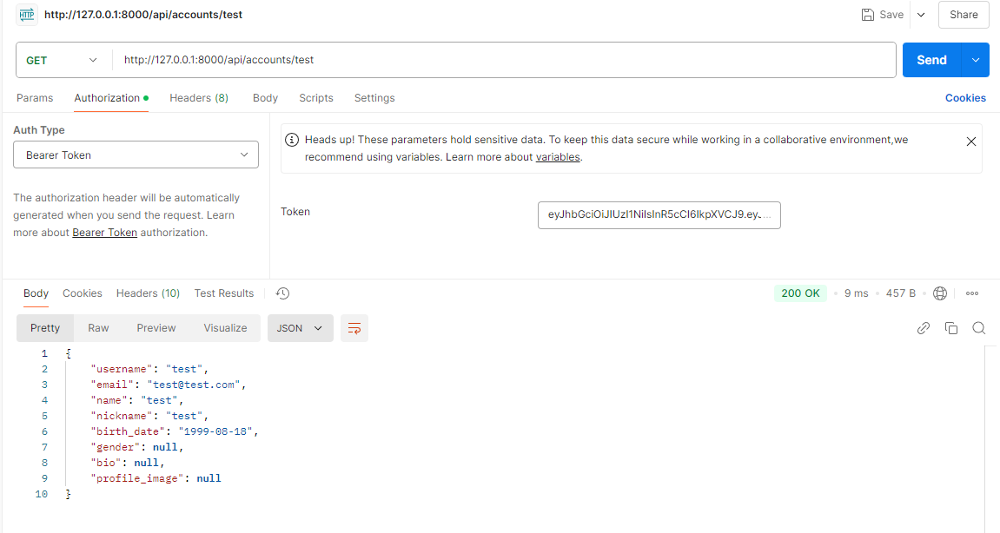

# CH4-DRF-Personal
# Django-DRF Personal Work

## 개요 
이 프로젝트는 스파르타 마켓의 DRF 구현으로 사용자가 자신의 프로필과 상품 정보를 관리 할 수 있는 RESTful API를 제공한다.  주요 기능은 아래와 같다.

  
1. 로그인 관리 : 회원가입, 로그인 을 할 수 있는 기능 제공.
2. 프로필 관리 : 로그인한 사용자가 자시느이 정보를 조회하는 기능 제공.
3. JWT 기반 인증 기능 제공.

&nbsp;
## 설치 및 실행

1. 프로젝트 클론
    - ` git clone <repo - url>`
    - ` cd <project-directory>` 

&nbsp;   

2. 가상환경 설정 및 활성화
    - `python -m venv venv`
    - `source venv/Scripts/activate`

&nbsp;

3. 패키지 설치
    - `pip install -r requirements.txt`

&nbsp;

4. 데이터베이스 마이그레이션
    - `python manage.py makemigrations`
    - `python manage.py migrate`

&nbsp;

5. 서버 실행
    - `python manage.py runserver`

---
## 기능 테스트

### 1. 회원가입

### 1.1. 회원가입 검증

### 1.2 회원가입 검증2

### 1.3 회원가입 검증3

&nbsp;

### 2. 로그인

### 2.2 로그인 검증

&nbsp;

### 3. 로그 아웃

&nbsp;

### 4. 상품 등록

### 4.1 상품 등록 검증

&nbsp;

### 5. 상품 조회

### 5.1 상품 조회 (페이지네이션)

&nbsp;

### 6. 상품 수정

### 6.1 상품 수정 검증

&nbsp;

### 7. 상품 제거

### 7.1 상품 제거 검증

### 7.2 상품 제거 후 리스트

&nbsp;

### 8. 프로필

### 8.1 프로필 검증

---
&nbsp;

## 트러블 슈팅

### 1. JWT 토큰 관련
- 문제 : Access Token 은 입력을 받는데 반에, Refrsh Token 을 받지 않음
- 해결 : settings 에서 토큰 라이브러리 등록

&nbsp;

### 2. 
